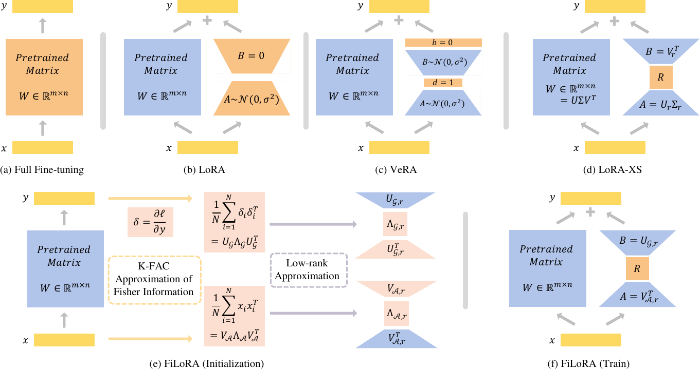

# FiLoRA: Parameter-Efficient Fine-Tuning with Fisher Information-Guided Low-Rank Adaptation

Official implementation of **FiLoRA**, a parameter-efficient fine-tuning (PEFT) method that constructs a Fisher-aligned low-rank update subspace and trains only a compact core matrix for downstream adaptation.

## Overview

FiLoRA introduces a geometry-aware alternative to standard LoRA-style fine-tuning. Instead of learning the whole low-rank decomposition from scratch, FiLoRA:

- estimates curvature-aware subspaces from a small number of downstream samples;
- uses a **K-FAC approximation** of the Fisher information matrix to identify informative update directions;
- freezes the left/right subspaces after initialization; and
- trains only a small **core matrix** inside the Fisher-dominated subspace.

In the paper, FiLoRA achieves strong performance on six GLUE tasks while using only **0.07M** trainable parameters.

## Method Illustration

<p align="center">
  
</p>

The figure above summarizes the relationship between **Full Fine-tuning**, **LoRA**, **VeRA**, **LoRA-XS**, and **FiLoRA**. In contrast to methods that rely on random or weight-only low-rank subspaces, **FiLoRA first estimates Fisher-aligned subspaces using a K-FAC approximation, then fine-tunes only the compact core matrix** \(R\). This design keeps the trainable parameter count extremely small while preserving task-relevant adaptation capacity.

## Repository Structure

The current repository is organized as follows:

```text
.
├── experiment/               # experiment scripts, configs, or result-related utilities
├── filoralib/                # core FiLoRA implementation
├── filoralib.egg-info/       # package metadata generated during installation
├── filora_framework.png      # source figure used in the README
├── pyproject.toml            # project/package configuration
├── README.md                 # project homepage
└── score_flora.py            # evaluation / scoring script
```

> If you rename or relocate files later, please update this section accordingly.

## Installation

This project uses a `pyproject.toml`-based layout. A typical setup is:

```bash
# create and activate your environment first
pip install -e .
```

If additional dependencies or environment requirements are needed for your experiments, please list them in `pyproject.toml` or provide a dedicated `requirements.txt` / environment file.


## Citation

If you find this repository useful, please cite:

> D. Han and S. Guo, "FiLoRA: Parameter-Efficient Fine-Tuning With Fisher Information-Guided Low-Rank Adaptation," in *IEEE Signal Processing Letters*, vol. 33, pp. 604-608, 2026, doi: 10.1109/LSP.2026.3652946.

```bibtex
@article{han2026filora,
  author   = {D. Han and S. Guo},
  title    = {FiLoRA: Parameter-Efficient Fine-Tuning With Fisher Information-Guided Low-Rank Adaptation},
  journal  = {IEEE Signal Processing Letters},
  volume   = {33},
  pages    = {604--608},
  year     = {2026},
  doi      = {10.1109/LSP.2026.3652946},
  keywords = {Matrix decomposition;Adaptation models;Training;Computational modeling;Eigenvalues and eigenfunctions;Covariance matrices;Vectors;Optimization;Costs;Tuning;Low-rank adaptation;Fisher information approximation;parameter-efficient fine-tuning;Kronecker-factored approximate curvature}
}
```

## Acknowledgements

If this repository builds on prior PEFT implementations or public training/evaluation codebases, please acknowledge them here in the final public version.
